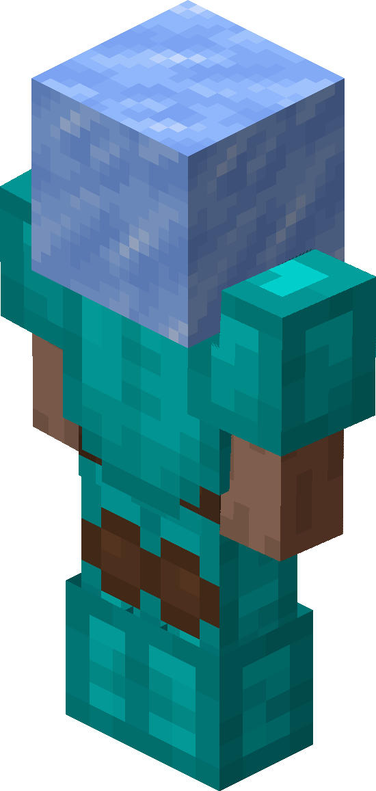
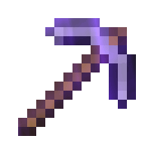
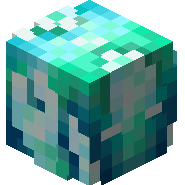
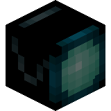
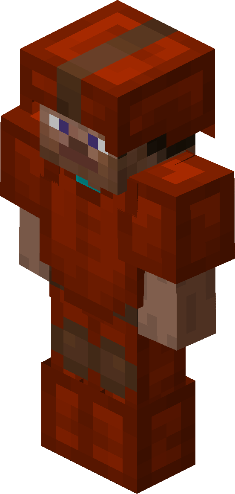
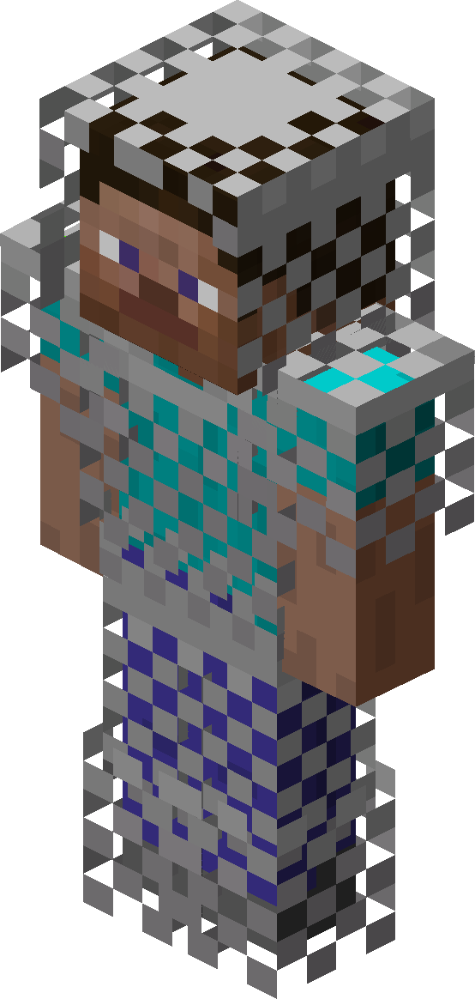
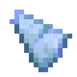
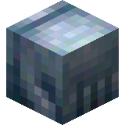
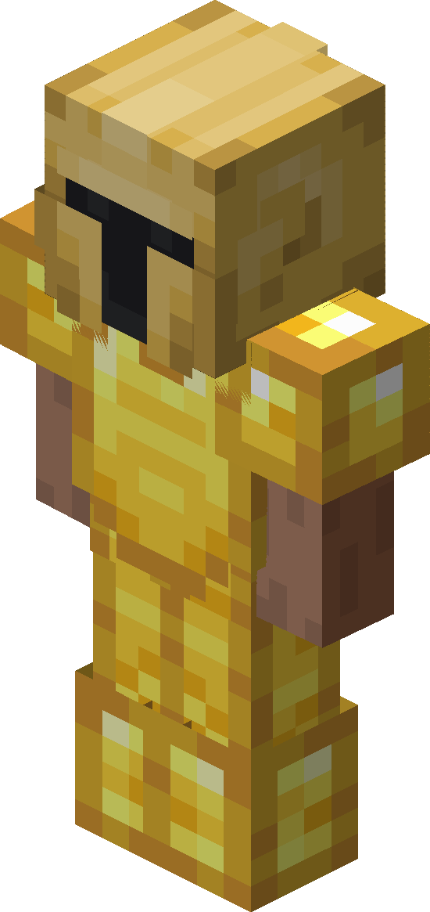

# 🌌 Rift


It's **important** you enable **World Caching** in the [**Path Finder**](../misc/pathfinding.md) module, so it works for the longer distances.


General

* **Auto Come Back:** Talks to the Wizard and joins the **Rift** again.\

- **Payment Mode:** Choice to pay with either **Grand Experience Bottles** or **Bits** when joining back.

* **Show Macro HUDs in their respective locations:** Will display the macro HUD even if not enabled.

* **Rotation Time Multiplier:** The rotation speed multiplier controls how fast rotations move - higher values make them slower. Best practice is to make the rotations look like something you can mimic.


Higher ping players can generally go faster than others. However if you want to be safe, just make the rotation look like **you**.


Farming

* **Agaricus Cap Auto Clicker:** Will click for you when the timing is right.


This is not needed for the **macro**. It will do that itself. Purely QOL if you want to do it urself.


* **Agaricus Cap Macro:** Will run around **Dread Farm** and farm them for you.

* **Wilted Berberis Macro:** Keybind to start the macro. It will start farming inside the field you press your bind in.

* **Wilted Berberis Turbo Mode:** This is a nuker for berberis, it will instantly farm multiple at further reach than normal.


This is ban on **Staff Spectate. Use at your own caution.**


* **Disable Turbo Mode Player Range:** Will disable the nuker is a player is within X blocks set on slider. If you put the slider to 0, nuker will not **turn on**.

* **Delay After Berberis Break:** Will delay your rotation to the next crop by X delay in ms set on the slider. A sweet spot is around 60ms to 100ms delay.\

* **Farm land priority:**
  * **Nearest**: Locates and starts the macro on the closest available farmland.
  * **Smallest**: Locates and starts the macro on the smallest available farmland.
  * **Enabled in**: Initiates farming in the field where the macro is started.

Other

* **Sun Gecko Macro**: Automate fishing Sun Gecko.

Mining

* **Timite Macro**: Keybind to start the macro.

* **Timite Macro Ore Type**: fuck this rn too tired to all options and explain them

* **Timite Macro Rotation Speed**: The rotation speed multiplier controls how fast rotations move - higher values make them slower. Best practice is to make the rotations look like something you can mimic.


Higher ping players can generally go faster than others. However if you want to be safe, just make the rotation look like **you**.


* **Auto Stun Snakes**: Will automatically mine and swap between your **Frozen Water Pungi** and **Self-Recursive Pickaxe**.

Crux

* **ESP Scribe Blocks**: Highlights scribe blocks for better visibility.

* **Auto Look At Scribe Blocks**: Will automatically look at all scribe blocks.


This is **ban** on **Staff Spectate**. **Use at your own caution**.


* **Auto Destroy Frozille's Ice**: Will automatically destroy all ice blocks before it explodes.


This should **not** ban on spectate, since you would also swing around your cursor legit.


* **Crux Esp**: Highlights all crux's for better visibility.

* **Splatter Heart Esp**: Highlights splatter hearts on the ground for better visibility.\

- **Splatter Heart Trace**: Shows a tracer to the hearts.

* **Crux Macro Type**: fuck that not doing the optionms rn 6:26 AM!!

Mirrorverse

Misc

Vampire

 Setup

To use this module, ensure the following:

* A keybind set for the Commissions Macro (configured in the [first option](../mining/dwarvencoms.md#features))
* Access to the **Dwarven Mines** area.
* Once in **Dwarven Mines**, press your bind and it'll automatically pathfind from where you start.


**Tip:** Forge warp is not **mandatory**, but highly recommended. When you are far away from the next commission, **Nebula** will warp you to the forge to get there faster.


***

### Recommended Setups



* **Armor Set**:  Glacite Armor
* **Tool**:  Bandaged / Mithril Pickaxe
* **Pet**:  Mithril Golem <mark style="color:purple;">\[E]</mark>
* **Equipment**:  4/4 Mithril Equipment reforged to **Royal**



* **Armor Set**:   Yog Armor reforged to **Dimensional**

> **Note**: If you have extra money, you can get  **Sorrow Armor**. The mining speed is minuscule so only get this if you have a lot of money to spare.

* **Tool**:  Mithril Drill SX-R226 reforged to **Fleet**
* **Pet**:  Mithril Golem <mark style="color:orange;">\[L]</mark>
* **Equipment**:  4/4 Mithril Equipment reforged to **Royal**

> **Note**: You can upgrade to  **Titanium Equipment** but you are not required to at this stage yet.



* **Armor Set**:  Divan Armor reforged to **Dimensional**
* **Tool**:  Mithril Drill SX-R326 reforged to **Fleet**
* **Pet**:  Mithril Golem <mark style="color:orange;">\[L]</mark>
* **Equipment**:  4/4 Titanium Equipment reforged to **Royal**



### Usage Notes

> **Tip:** Make sure to set your sword slot number correctly for goblin commissions -- the module will auto-switch to that slot when needed.

> **Note:** The warp mines feature only works after reaching Commission Milestone 4, so early players will need to travel manually. Use "/visit mid" or other portal islands to get there faster.

The module works best when you have the base Mithril **HOTM** perks unlocked and decent mining gear. It'll handle the repetitive parts of commission grinding while you can focus on other task
